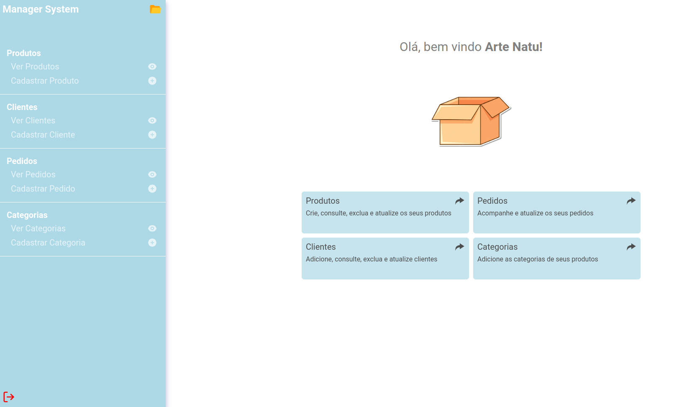
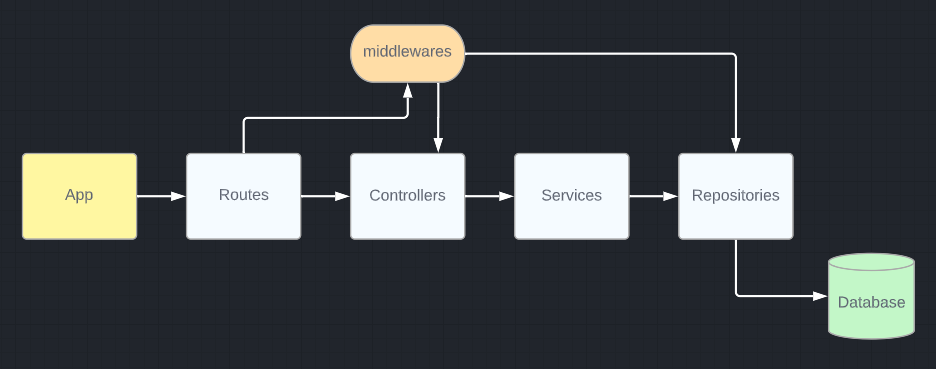

  <h1>MANAGER SYSTEM (MVP)</h1>
   
  - Back-end de uma aplicação web para gerenciamento de uma loja. Esse é um projeto full stack. <a href = "https://github.com/guedesclaudio/managersystem">Repositório do front-end</a>
   
   
  
   
   

 

# Arquitetura

    

 
 
 

# Funcionalidades
- Acesso restrito ao lojista cadastrado
- Acesso as requisições através de token
- Armazenamento dos dados utilizando PostgreSQL
- CRUD de categorias, produtos, clientes e pedidos
- Deploy com Vercel (back-end) e Render (banco de dados)
 
 

# Tecnologias utilizadas
- Node.js
- EXPRESS
- CORS
- DOTENV
- JOI
- POSTGRESQL
- UUID
- GIT
- GITHUB
- VSCODE
- LINUX

 